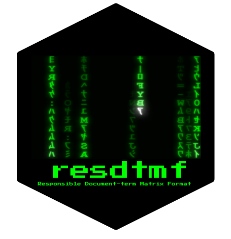

<!-- README.md is generated from README.Rmd. Please edit that file -->

```{r, include = FALSE}
knitr::opts_chunk$set(
  collapse = TRUE,
  comment = "#>",
  fig.path = "man/figures/README-",
  out.width = "100%"
)
```
# resdtmf 

<!-- badges: start -->
<!-- badges: end -->

The goal of Responsible Document-term Matrix Format (`resdtmf`, pronounced as "res-dumf" /ˈɹɪzdəmf/) is to create a machine-readable, plain-text and exchangable file format of document-term matrices (dtm, or in quanteda's parlance, document-feature matrices).

Currently, there is no standard format for document-term matrics. A resdtmf file is a JSON file with the following five components:

1. `triplets`: a collection of triplets which are tuples of 3 values: docid (document id), tid (term id), f (frequncy)
2. `features`: a collection of features which are tuples of 2 values: tid (term id), term (the term itself)
3. `dumped_docvars`: meta-data of each document
4. `dumped_meta`: meta-data of the entire dtm
5. `order_of_content`: a collection of tuples of 2 values: order (numeric sequence of order), docid.

This is an example of a resdtmf file.

```json
{
  "triplets": [
    {
      "docid": "text1",
      "tid": 1,
      "f": 1
    },
    {
      "docid": "text3",
      "tid": 1,
      "f": 1
    },
    {
      "docid": "text1",
      "tid": 2,
      "f": 1
    },
    {
      "docid": "text2",
      "tid": 2,
      "f": 1
    },
    {
      "docid": "text1",
      "tid": 3,
      "f": 1
    },
    {
      "docid": "text2",
      "tid": 3,
      "f": 1
    },
    {
      "docid": "text3",
      "tid": 3,
      "f": 1
    },
    {
      "docid": "text2",
      "tid": 4,
      "f": 1
    },
    {
      "docid": "text3",
      "tid": 5,
      "f": 1
    }
  ],
  "features": [
    {
      "tid": 1,
      "term": "i"
    },
    {
      "tid": 2,
      "term": "love"
    },
    {
      "tid": 3,
      "term": "you"
    },
    {
      "tid": 4,
      "term": "me"
    },
    {
      "tid": 5,
      "term": "hate"
    }
  ],
  "dumped_docvars": [
    {
      "docid": "text1",
      "sentiment": 1
    },
    {
      "docid": "text2",
      "sentiment": 1
    },
    {
      "docid": "text3",
      "sentiment": 0
    }
  ],
  "dumped_meta": [],
  "order_of_content": [
    {
      "order": 1,
      "docid": "text1"
    },
    {
      "order": 2,
      "docid": "text2"
    },
    {
      "order": 3,
      "docid": "text3"
    }
  ]
}
```

We also believe that a responsible DTM should have enough meta data to describe the meaning of the data. This package supports [Dublin Core](https://dublincore.org/) (DCMES 1.1).

## Installation

Install the development version from [GitHub](https://github.com/) with:

``` r
# install.packages("devtools")
devtools::install_github("chainsawriot/resdtmf")
```
## Example - Basic serialization

Suppose you have a simple document-feature matrix like this:

```{r example}
require(quanteda)
require(magrittr)
require(resdtmf)

quanteda::corpus(c('i love you', 'you love me', 'i hate you'),
                 docvars = data.frame(sentiment = c(1,1,0))) %>%
    quanteda::dfm() -> input_dfm
input_dfm
```

This document-feature matrix can be exported into a json file with:

```{r}
export_resdtmf(input_dfm, "example.json")
```

The file is machine-readable.

```{r}
readLines("example.json")
```

It can be imported easily back into R.

```{r}
example_dfm <- import_resdtmf("example.json")
example_dfm
```

And the metadata is preserved.

```{r}
docvars(example_dfm)
```

And everything is equal.

```{r}
all.equal(example_dfm, input_dfm)
```

It is also possible to convert the imported dfm into another format, e.g. "data.frame".

```{r}
example_dfm_df <- import_resdtmf("example.json", convert_to = "data.frame")
class(example_dfm_df)
```

```{r}
example_dfm_df
```

Example: serializing a DTM created using the `data_corpus_inaugural` data.

```{r}
inaugural_dfm <- dfm(data_corpus_inaugural)
export_resdtmf(inaugural_dfm, "inaug_dfm.json")
```

```{r}
inaugural_dfm_from_json <- import_resdtmf("inaug_dfm.json")
inaugural_dfm_from_json
```

```{r}
all.equal(inaugural_dfm, inaugural_dfm_from_json)
```

Using compression

```{r}
export_resdtmf(inaugural_dfm, "inaug_dfm2.json", compress = TRUE)
file.size("inaug_dfm.json")
file.size("inaug_dfm2.json.zip")
```

```{r}
inaugural_dfm_from_json_zip <- import_resdtmf("inaug_dfm2.json.zip")
all.equal(inaugural_dfm, inaugural_dfm_from_json_zip)
```

## Example - Dublin Core

```{r}
quanteda::corpus(c('i love you',
                   'you love me',
                   'baka shinji',
                   'ich liebe dict obwohl du ssss bist'),
                 docvars = data.frame(sentiment = c(1,1,0,1))) %>%
    quanteda::dfm() -> input_dfm
input_dfm
```

```{r}
dc_meta <- create_dc(
    title = c("Romeo + Juliet", "Moulin Rouge!", "Neon Genesis: Evangelion", "Mord ist mein Geschäft, Liebling"),
    format = "Document-term Matrix",
    language = c("en", "en", "ja", "de"))

input_dfm2 <- put_dc(input_dfm, dc_meta)
input_dfm2
```

Inspecting DCMES 1.5 data (similar to the `tm::DublinCore` method).

```{r}
inspect_dc(input_dfm2[4,])
```

Serialization

```{r}
export_resdtmf(input_dfm2, "input_dfm2.json")
input_dfm3 <- import_resdtmf("input_dfm2.json")
inspect_dc(input_dfm3[4,])
```

```{r, include = FALSE}
### Clean up
unlink("inaug_dfm2.json.zip")
unlink("inaug_dfm.json")
unlink("input_dfm2.json")
unlink("example.json")
```
